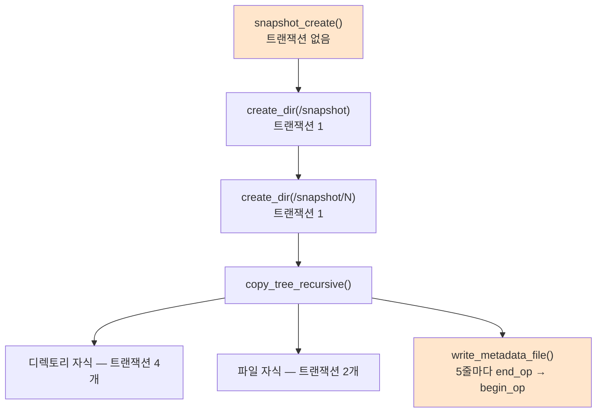
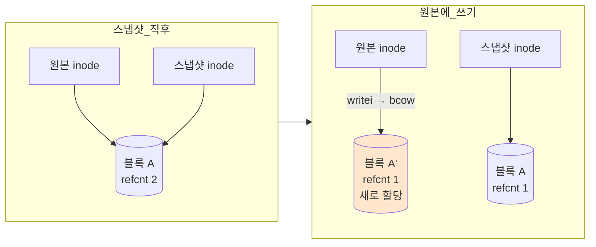
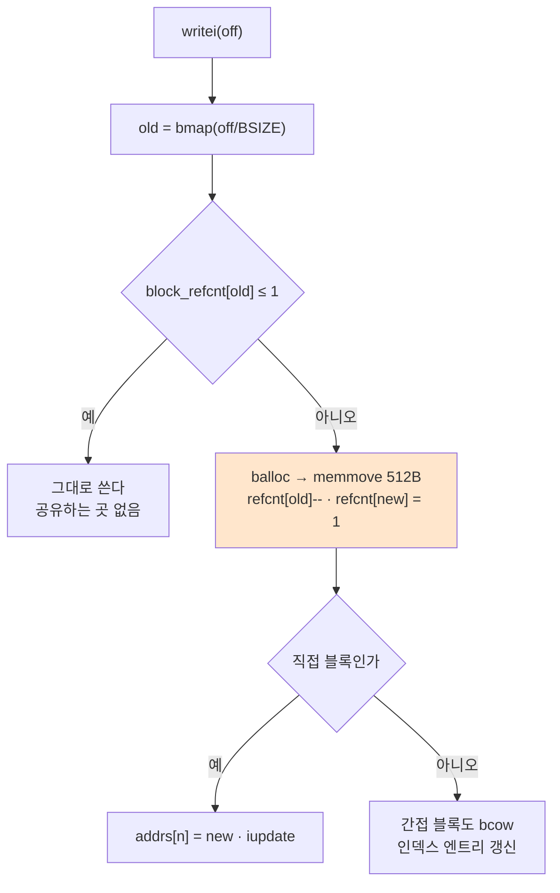
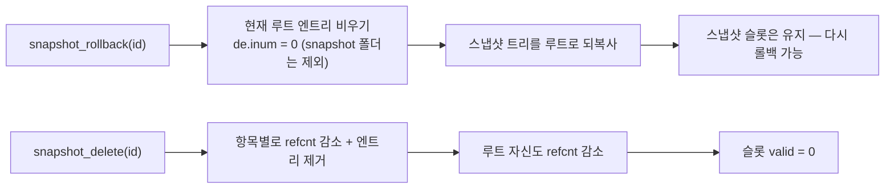

<div align="center">

# ⚙️ XV6 Snapshot & Checkpointing

**XV6 운영체제 파일 시스템에 Copy-On-Write 기반 스냅샷 기능 구현**

[](https://github.com/joejaeyoung/OS-Project_SnapshotCheckpointing)

</div>

---

## 📋 프로젝트 정보

|    항목     | 내용                  |
| :-------: | :------------------ |
|  **분야**   | OS (운영체제)           |
| **개발 기간** | 2025.12             |
| **개발 환경** | Ubuntu Linux + QEMU |

---

## 📖 프로젝트 소개

이 프로젝트는 MIT에서 개발한 교육용 운영체제 **XV6**의 파일 시스템에 **Copy-On-Write(COW) 기반 스냅샷(Snapshot) 기능**을 구현한 프로젝트입니다.

기존 XV6는 스냅샷이나 증분 백업을 지원하지 않으므로, 특정 시점의 파일 시스템 상태를 보존하고 복구하는 기능을 추가합니다. 스냅샷 생성 시 데이터 블록 전체를 복사하는 대신 **기존 블록을 참조하는 방식**을 사용하여 공간 효율성을 높이고, 데이터 수정 시에만 새로운 블록을 할당하는 **COW 메커니즘**을 적용하여 멀티 버전 파일 시스템을 설계 및 구현합니다.

### 핵심 구현 사항

- **Block COW** — 블록 레벨의 Copy-On-Write로 스냅샷 간 블록 공유 및 무결성 보장
- **스냅샷 시스템 콜** — `snapshot_create`, `snapshot_rollback`, `snapshot_delete` 인터페이스 제공
- **블록 참조 카운팅** — `block_refcnt[]` 배열로 블록별 참조 횟수 추적
- **재귀적 트리 복사** — 디렉토리 구조 전체를 재귀적으로 복사/복원/삭제

---

## 🏗️ 아키텍처

### 문제: 트리 하나를 한 트랜잭션에 담을 수 없다

XV6 로그는 트랜잭션당 쓸 수 있는 블록 수가 정해져 있습니다. 그런데 스냅샷은 루트 디렉토리 전체를 복사하는 작업입니다.
처음 구현은 `snapshot_create` 전체를 `begin_op` / `end_op`로 감쌌고, 파일이 몇 개만 늘어도 로그가 넘쳐 panic이 났습니다.

**그래서 감싸는 자리를 바깥에서 안으로 옮겼습니다.** `snapshot_create` 자체에는 트랜잭션이 없고, 하위 작업이 각자 열고 닫습니다.



| 작업 단위 | 트랜잭션 분할 |
| --- | --- |
| 디렉토리 자식 복사 | ① `ialloc` + 메타 ② `dirlink "."` ③ `dirlink ".."` ④ 부모에 `dirlink` |
| 파일 자식 복사 | ① `ialloc` + addrs 복사 + refcnt 증가 ② 부모에 `dirlink` |
| 메타 파일 쓰기 | 파일 생성 / `itrunc` 1개, 이후 **5줄마다 닫고 다시 엶** |
| 스냅샷 삭제 | 항목 1개당 1개 |

재귀 중에는 자식을 건드리기 전에 부모 inode의 sleeplock을 풀었다가 끝나면 다시 잡습니다. 트랜잭션 안에서 락을 오래 쥐지 않기 위한 것입니다.

### 복사가 아니라 공유 — Copy-On-Write

스냅샷은 데이터 블록을 복사하지 않습니다. **같은 블록을 가리키게 하고 참조 카운트만 올립니다.**



파일을 공유할 때 refcnt를 올리는 대상은 직접 블록 12개, 간접 블록 자신, 그리고 **간접 블록이 가리키는 128개 엔트리 전부**입니다.

### bcow() — 쓰기 직전에 갈라진다



간접 블록을 쓸 때는 **데이터 블록과 인덱스 블록 둘 다** COW 대상입니다. 인덱스 블록을 공유한 채로 엔트리만 고치면 스냅샷 쪽 경로까지 바뀌어 버리기 때문입니다.

### 해제는 마지막 참조에서만

```c
static void bfree(int dev, uint b) {
  if (block_refcnt[b] > 0) block_refcnt[b]--;
  if (block_refcnt[b] == 0) {
    // 이때만 비트맵에서 실제로 내린다
  }
}
```

### 롤백과 삭제



### 추가한 시스템 콜

| 번호 | 시그니처 | 하는 일 |
| ---: | --- | --- |
| 22 | `int snapshot_create(void)` | 스냅샷 생성, ID 반환 |
| 23 | `int snapshot_rollback(int snap_id)` | 해당 스냅샷 상태로 되돌림 |
| 24 | `int snapshot_delete(int snap_id)` | 스냅샷 제거 |
| 25 | `int get_file_addrs(char *path, uint *addrs)` | 디버깅용 — inode의 addrs 조회 |
| 26 | `int get_indirect_addrs(uint blockno, uint *out)` | 디버깅용 — 간접 블록 엔트리 조회 |

최대 스냅샷 수는 10개이고, 반복 생성으로 inode가 바닥나는 문제를 만나 `mkfs`의 `NINODES`를 200에서 500으로 늘렸습니다.

---

## 🚀 시작 가이드

### Requirements

- GCC (i686-linux-gnu cross compiler)
- GNU Make
- QEMU (qemu-system-i386)

### Installation & Run

```bash
# 1. XV6 원본 소스 클론
$ git clone https://github.com/mit-pdos/xv6-public.git
$ cd xv6-public

# 2. Snapshot 소스 클론 및 덮어쓰기
$ git clone https://github.com/jojaeyoung/OS-Project_SnapshotCheckpointing.git
$ cp OS-Project_SnapshotCheckpointing/srcs/* .

# 3. 빌드 및 실행
$ make qemu
```

### 테스트 실행 (XV6 쉘 내부)

```bash
# 스냅샷 생성
$ snap_create

# 스냅샷으로 롤백
$ snap_rollback <snapshot_id>

# 스냅샷 삭제
$ snap_delete <snapshot_id>

# 종합 테스트
$ snap_test

# 파일 블록 주소 확인 (디버깅)
$ print_addr <filename>
```

---

## ⚠️ 알려진 한계

- **재부팅하면 스냅샷이 사라집니다.** `/snapshot/meta`는 쓰기만 하고 읽는 코드가 없습니다. `snapinit()`이 참조 카운트와 스냅샷 테이블을 전부 0으로 초기화합니다.
- **`bcow()`가 `block_refcnt`를 락 없이 읽고 씁니다.** 소스에도 `//todo : 동시성 문제 방지를 위해 Lock 고려`로 남겨 두었습니다. 단일 프로세스 시나리오만 검증했습니다.
- **`copy_file_with_cow()`는 데드 코드입니다.** 정의만 있고 호출되지 않습니다. 실제 공유는 `copy_tree_recursive` 안에 인라인되어 있습니다.
- **`metadata_cache` 구조체도 데드 코드입니다.**
- **롤백이 이전 루트의 블록을 회수하지 않습니다.** 디렉토리 엔트리를 `de.inum = 0`으로 덮어쓰기만 하고 inode와 블록은 그대로 둡니다.
- `snapshot_create`가 `iput()` 이후에 `snap_root->inum`을 읽습니다.
- `write_metadata_file`은 `FSSIZE`까지 순회하는데 `block_refcnt` 배열 크기는 `MAXBLOCKS`(10,000)입니다. 두 값의 근거가 서로 다릅니다.
- `param.h`를 덮어쓰지 않아 `LOGSIZE` · `MAXOPBLOCKS`는 업스트림 기본값을 따릅니다.

---

## 🛠️ Stacks

### Environment


### Development


### Config


---

## 📺 시스템 콜 인터페이스

### `snapshot_create(void)`

| 항목 | 설명 |
|:---|:---|
| **시스템 콜 번호** | 22 |
| **인자** | 없음 |
| **반환값** | 성공 시 스냅샷 ID, 실패 시 `-1` |
| **동작** | 현재 파일 시스템 상태를 `/snapshot/[ID]`에 COW 방식으로 저장 |

### `snapshot_rollback(int snap_id)`

| 항목 | 설명 |
|:---|:---|
| **시스템 콜 번호** | 23 |
| **인자** | `snap_id` — 복구할 스냅샷 ID |
| **반환값** | 성공 시 `0`, 실패 시 `-1` |
| **동작** | 현재 파일 시스템을 해당 스냅샷 시점으로 복원 (`/snapshot` 제외) |

### `snapshot_delete(int snap_id)`

| 항목 | 설명 |
|:---|:---|
| **시스템 콜 번호** | 24 |
| **인자** | `snap_id` — 삭제할 스냅샷 ID |
| **반환값** | 성공 시 `0`, 실패 시 `-1` |
| **동작** | 스냅샷 디렉토리 재귀 삭제 및 블록 참조 카운트 갱신 |

#### 사용 예시

```c
// 스냅샷 생성
int snap_id = snapshot_create();

// 스냅샷으로 롤백
snapshot_rollback(snap_id);

// 스냅샷 삭제
snapshot_delete(snap_id);
```

---

## ⭐ 주요 기능

### 1. Block Copy-On-Write (bcow)

- 파일 수정 요청 시 해당 블록의 **참조 카운트 확인**
- 참조 카운트 > 1인 경우 **새 블록을 할당하여 데이터 복사** (원본 보존)
- 참조 카운트 ≤ 1인 경우 **기존 블록에 직접 수정** (COW 불필요)
- `writei()` 함수에서 직접/간접 블록 모두에 COW 적용

### 2. 블록 참조 카운팅 (Reference Counting)

- `block_refcnt[MAXBLOCKS]` 배열로 각 블록의 참조 횟수 관리
- 스냅샷 생성 시 참조 카운트 증가 (실제 복사 없이 블록 공유)
- `bfree()` 수정: 참조 카운트가 **0이 될 때만** 실제 블록 해제

### 3. 스냅샷 생성 (snapshot_create)

- 스냅샷 테이블에서 빈 슬롯 할당 및 ID 발급
- `/snapshot/[ID]` 디렉토리 생성
- `copy_tree_recursive()` 로 **루트부터 전체 파일 트리 재귀 복사**
- 파일의 데이터 블록은 복사하지 않고 **inode의 블록 주소만 복사** (COW)
- `/snapshot` 디렉토리와 `T_DEV` 파일은 캡처 대상에서 제외
- 메타데이터 파일(`/snapshot/meta`)에 참조 카운트 기록

### 4. 스냅샷 롤백 (snapshot_rollback)

- `clear_directory_recursive()` 로 현재 파일 시스템 정리 (`/snapshot` 보존)
- `refresh_from_snapshot()` 로 스냅샷 디렉토리에서 **루트로 복원**
- 복원 후에도 **모든 스냅샷은 유지**되어 재차 롤백 가능

### 5. 스냅샷 삭제 (snapshot_delete)

- `delete_tree_recursive()` 로 스냅샷 디렉토리 트리 재귀 삭제
- `decrease_block_references()` 로 참조 카운트 감소
- 참조 카운트가 0인 블록만 실제 해제
- 스냅샷 테이블에서 해당 슬롯 무효화

### 6. 메타데이터 관리

- `/snapshot/meta` 파일에 블록별 참조 카운트를 `Block N: refcnt=M` 형식의 텍스트로 덤프
- 트랜잭션 단위로 분할 기록하여 **로그 용량 초과 방지** (5줄마다 `end_op` → `begin_op`)
- **읽어 들이는 코드는 없습니다.** 부팅 시 `snapinit()`이 `block_refcnt`를 0으로 초기화하므로 영속성은 성립하지 않습니다. 디버깅용 덤프입니다
- `metadata_cache` 구조체는 선언만 되어 있고 어느 필드도 사용되지 않습니다

---

## 🏗️ 아키텍쳐

### 스냅샷 동작 흐름

```
┌─────────────────────────────────────────────────────────┐
│                  Snapshot Create Flow                     │
├─────────────────────────────────────────────────────────┤
│ snap_create (user)                                       │
│   → SYS_snapshot_create (syscall)                        │
│     → snapshot_create() (fs.c)                           │
│       → 스냅샷 슬롯 할당 & ID 발급                         │
│       → /snapshot/[ID] 디렉토리 생성                       │
│       → copy_tree_recursive() — 전체 파일 트리 재귀 복사     │
│         → 파일: 블록 주소 공유 + 참조 카운트 증가 (COW)       │
│         → 디렉토리: 미러 구조 생성                           │
│       → write_metadata_file() — 참조 카운트 기록             │
└─────────────────────────────────────────────────────────┘

┌─────────────────────────────────────────────────────────┐
│                 Snapshot Rollback Flow                    │
├─────────────────────────────────────────────────────────┤
│ snap_rollback [ID] (user)                                │
│   → SYS_snapshot_rollback (syscall)                      │
│     → snapshot_rollback() (fs.c)                         │
│       → clear_directory_recursive() — 현재 FS 정리        │
│       → refresh_from_snapshot() — 스냅샷에서 복원           │
│       → 모든 스냅샷 유지 (재차 롤백 가능)                    │
└─────────────────────────────────────────────────────────┘

┌─────────────────────────────────────────────────────────┐
│              Copy-On-Write (writei 호출 시)               │
├─────────────────────────────────────────────────────────┤
│ writei()                                                 │
│   → bcow(blockno) — 참조 카운트 확인                       │
│     → refcnt > 1: balloc() → memmove() → 새 블록 반환      │
│     → refcnt ≤ 1: 기존 블록 그대로 반환                      │
│   → 반환된 블록에 데이터 기록                                │
└─────────────────────────────────────────────────────────┘
```

### 핵심 상수 정의

| 상수 | 값 | 설명 |
|:---|:---:|:---|
| `MAXBLOCKS` | 10,000 | 블록 참조 카운트 배열 크기 |
| `MAX_SNAPSHOTS` | 10 | 동시 보유 가능한 최대 스냅샷 수 |
| `BSIZE` | 512 | 블록 크기 (bytes) |
| `NDIRECT` | 12 | inode당 직접 블록 포인터 수 |
| `NINDIRECT` | 128 | 간접 블록 엔트리 수 (BSIZE/sizeof(uint)) |
| `MAXFILE` | 140 | 최대 파일 블록 수 (NDIRECT + NINDIRECT) |

### 주요 데이터 구조

#### 스냅샷 관리 구조체

```c
struct snapshot {
    int id;              // 스냅샷 ID
    int valid;           // 유효 플래그
    uint root_inode;     // 스냅샷 루트 inode 번호
};

struct snapshot_table {
    struct spinlock lock;
    struct snapshot snapshots[MAX_SNAPSHOTS];
    int next_id;
};
```

#### 블록 참조 카운트

```c
uint block_refcnt[MAXBLOCKS];  // 블록별 참조 카운트 배열

struct metadata_cache {
    struct spinlock lock;
    int dirty;
    int is_initialized;
    uint block_refcnt[MAXBLOCKS];
} meta;
```

### 디렉토리 구조

```
OS-Project_SnapshotCheckpointing/
├── README.md
└── srcs/
    ├── Makefile           # 빌드 설정 (테스트 바이너리 등록)
    ├── fs.h               # 파일 시스템 헤더 (스냅샷 구조체 + 상수 정의)
    ├── fs.c               # 핵심 로직 (COW, 스냅샷 CRUD, 재귀 트리 연산)
    ├── sysfile.c          # 파일 시스템 시스템 콜 구현
    ├── syscall.h          # 시스템 콜 번호 정의 (22~26)
    ├── syscall.c          # 시스템 콜 디스패치 테이블 등록
    ├── user.h             # 유저 공간 함수 프로토타입
    ├── usys.S             # 시스템 콜 어셈블리 스텁
    ├── main.c             # 커널 초기화 (snapinit 호출)
    ├── mkfs.c             # 파일 시스템 이미지 생성 (inode 500개로 확장)
    ├── snap_create.c      # 유저 프로그램: 스냅샷 생성
    ├── snap_delete.c      # 유저 프로그램: 스냅샷 삭제
    ├── snap_rollback.c    # 유저 프로그램: 스냅샷 롤백
    ├── snap_test.c        # 종합 테스트 (8가지 시나리오)
    ├── print_addr.c       # 디버깅: 파일 블록 주소 출력
    ├── mk_test_file.c     # 유틸리티: 테스트 파일 생성
    └── append.c           # 유틸리티: 파일 내용 추가
```

### 수정 파일 역할 관계

| 파일 | 역할 | 핵심 변경 사항 |
|:---|:---|:---|
| `fs.h` | 데이터 구조 | `snapshot`, `snapshot_table` 구조체 + `block_refcnt` 배열 + 상수 매크로 |
| `fs.c` | 스냅샷 핵심 | `bcow()`, `snapshot_create/rollback/delete()`, `copy/clear/delete_tree_recursive()`, `write_metadata_file()` |
| `sysfile.c` | 시스템 콜 래퍼 | 스냅샷 시스템 콜 5종 래퍼 함수 |
| `syscall.h/c` | 시스템 콜 등록 | 시스템 콜 번호 22~26 등록 및 디스패치 |
| `user.h` + `usys.S` | 유저 인터페이스 | 유저 공간에서 호출 가능하도록 등록 |
| `main.c` | 커널 초기화 | `snapinit()` 호출 추가 |
| `mkfs.c` | FS 이미지 생성 | inode 수 500개로 확장 |
| `Makefile` | 빌드 설정 | 테스트 바이너리 UPROGS 등록 |

---

## 🧪 테스트

`snap_test` 프로그램은 다음 8가지 시나리오를 자동으로 검증합니다:

| 번호 | 테스트 내용 | 검증 항목 |
|:---:|:---|:---|
| 1 | 초기 스냅샷 생성 | 스냅샷 ID 반환 확인 |
| 2 | 파일 생성 후 두 번째 스냅샷 | 파일 포함 스냅샷 생성 |
| 3 | 스냅샷 이후 파일 수정 | COW 동작 확인 |
| 4 | 스냅샷 2로 롤백 | 수정 전 상태 복원 확인 |
| 5 | 스냅샷 1로 롤백 | 테스트 파일 미존재 확인 |
| 6 | 스냅샷 삭제 | 정상 삭제 및 블록 해제 |
| 7 | 삭제된 스냅샷 롤백 시도 | 오류 반환 확인 |
| 8 | 유효하지 않은 ID 처리 | `-1` 반환 확인 |

```bash
# XV6 쉘에서 실행
$ snap_test
```
